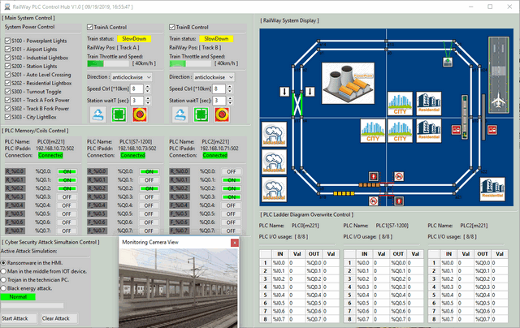
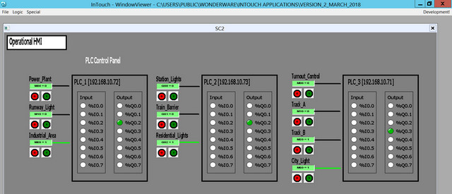
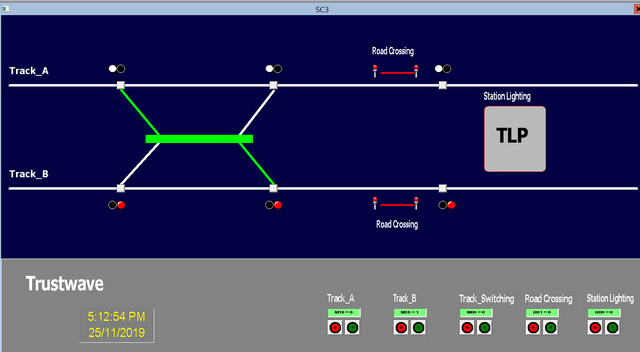

# Railway_PLC_Control/Attack

#### Introduction

This project contains two section :  

**PLC-Railway HMI System** : In this section we will create 2 Railway PLC SCADA HMI system with schneider wonderware(R) program and python for the user to control the PLC railway modules or simulate different railway operation for training or research purpose. 

**PLC-SCADA System Attack** :  In this section we will show different kinds of cyber attack situation on the Railway SCADA system which we have build in the previous section. Detail introduction for the attack section: 

[]: https://github.com/LiuYuancheng/RailWay_PLC_Control/tree/master/attack/remoteAtk	"Attack Readme"

UI view of the PLC-Railway HMI system: 

###### Python Railway HMI UI



> Python railway HMI is used to simulate different control situation and simulate three kinds of general program attack. 
>
> - Control the different components in the rail way system and 2 trains.
> -  Show the PLC information on the PLC control area and user can turn on/off PLC coils from this tab.
> - Show the PLC Memory /register status or overwrite PLC data.\
> - Change the system setting and start different cyber attack simulation.(man in mid, Trojan and  Ransomware attack)


###### Schneider Wonderware HMI UI

Main control window :


PLC control window : 



RailWay state window : 



> Schneider Wonderware HMI is used for training and cyber-attack demo.


###### Cyber attack : 

To run the demo, please deploy the programs by following below diagram: 


------

#### Program Setup

###### Development Environment : Python 2.7 & python 3.7,  HTML5, Schneider Wonderware IDE

###### Additional Lib/Software Need :

1. wxPython 4.0.6 (build UI this lib need to be installed) 

   ```
   pip install -U wxPython 
   ```

2. snap7 + python-snap7 (need to install for S71200 PLC control) 

   ```
   Install instruction: 
   http://simplyautomationized.blogspot.com/2014/12/raspberry-pi-getting-data-from-s7-1200.html
   ```

###### Hardware Needed : 

​	The system use Schneider M221 and Siemens s7-1200 to control the hardware. 

​	PLC memory and coils setting: 

| PLC 0 [schneider M221]      | PLC 1 [seimens S7-1200]         | PLC 2 [schneider M221]   |
| --------------------------- | ------------------------------- | ------------------------ |
| 192.168.10.72               | 192.168.10.73                   | 192.168.10.71            |
| M0  => Q0.0 Airport LED     | Qx0.0 => Q0.0 station + sensor  | M0  => Q0.0 fork turnout |
| M10 => Q0.1 Power Plant     | Qx0.1=> Q0.1 level crossing pwr | M10 => Q0.1 track A pwr  |
| M60 => Q0.2 Industrial LED  | Qx0.2=> Q0.2 Resident LED       | M20 => Q0.2 track B pwr  |
| attack/Industrial_Zone.smbp | attack/ City_Zone.smbp          | M60 = > Q0.3 city LED    |

###### Program File List :

| Program File                | Execution Env            | Description                                                  |
| --------------------------- | ------------------------ | ------------------------------------------------------------ |
| src/M2PLC221.py             | python 2.7/3             | This module is used to connect the Schneider M2xx PLC.       |
| src/railwayAgentPLC.py      | python 3                 | This module is the agent module to init different items in the railway system or create the interface to connect to the hardware. |
| src/railwayGlobal.py        | python 3                 | This module is used as the local config file to set constants, global parameters which will be used in the other modules. |
| src/railwayHub.py           | python 3                 | This function is used to create a rail control hub to show the different situation of the cyber-security attack's influence for the railway HMI and PLC system. |
| src/railwayMgr.py           | python 3                 | This function is the railway function manager to connect the agent element with their control panel. |
| src/railWayPanel.py         | python 3                 | This module is used to provide different function panels for the rail way hub function. |
| src/railWayPanelMap.py      | python 3                 | This module is used to show the top view of the main city map in the railway system. |
| src/ S7PLC1200.py           | python 3                 | This module is used to connect the siemens s7-1200 PLC       |
| attack/ City_Zone.smbp      | Schneider Wonderware IDE | City Zone PLC ladder diagram.                                |
| attack/Industrial_Zone.smbp | Schneider Wonderware IDE | Industrial Zome PLC ladder diagram.                          |

------

#### Program Usage

###### Program execution cmd: 

```
python railwayHub.py
```


------

> Last edit by LiuYuancheng(liu_yuan_cheng@hotmail.com) at 08/01/2020