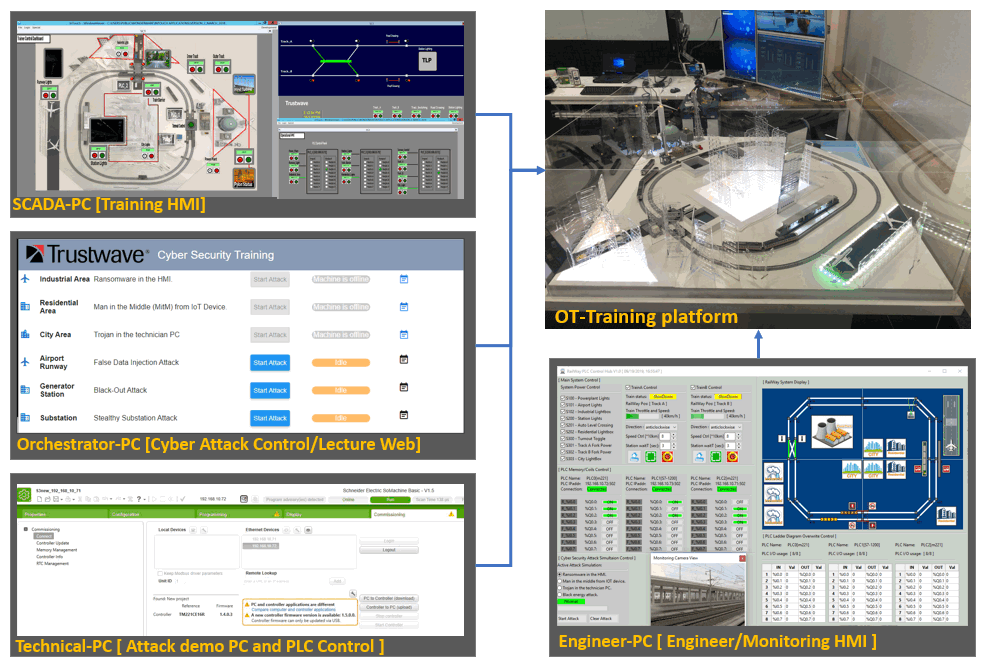
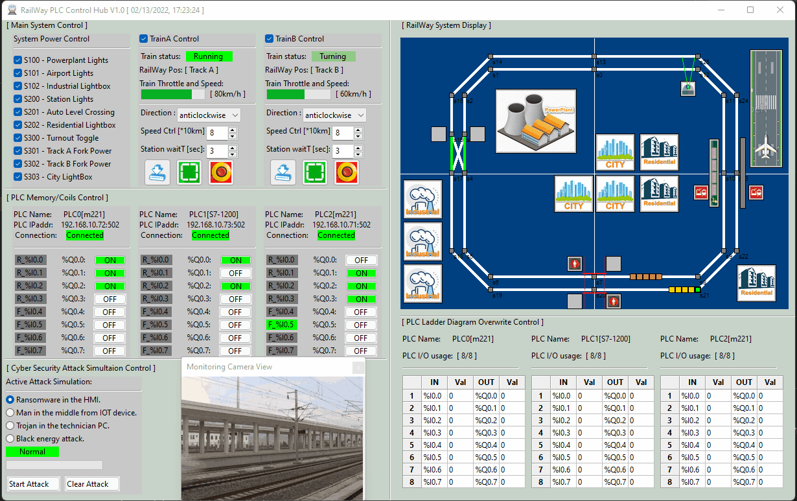
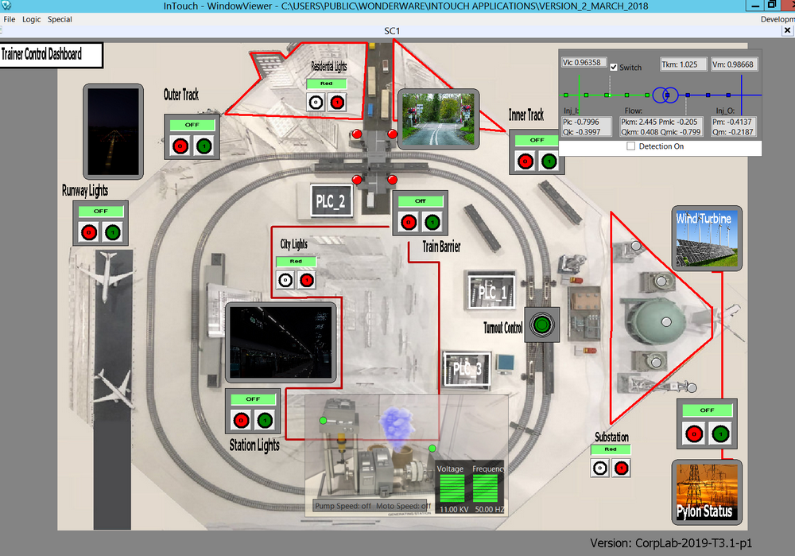
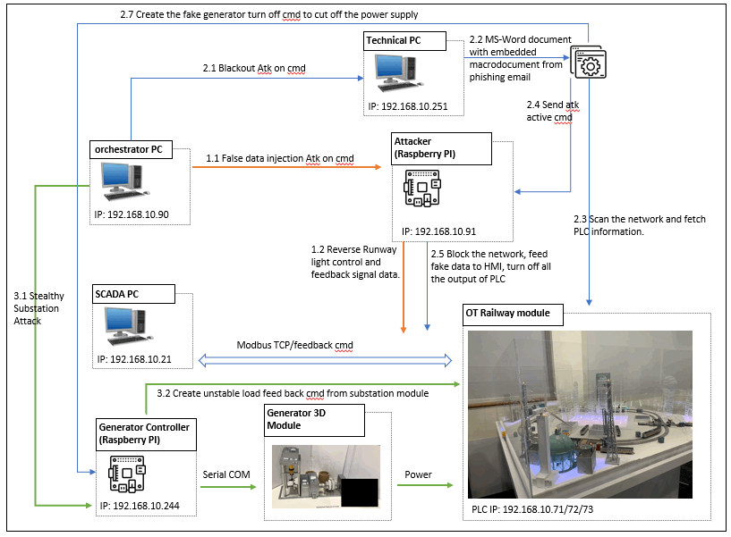
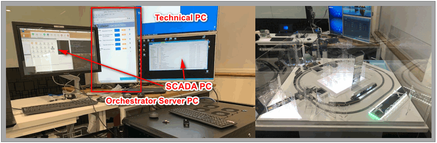
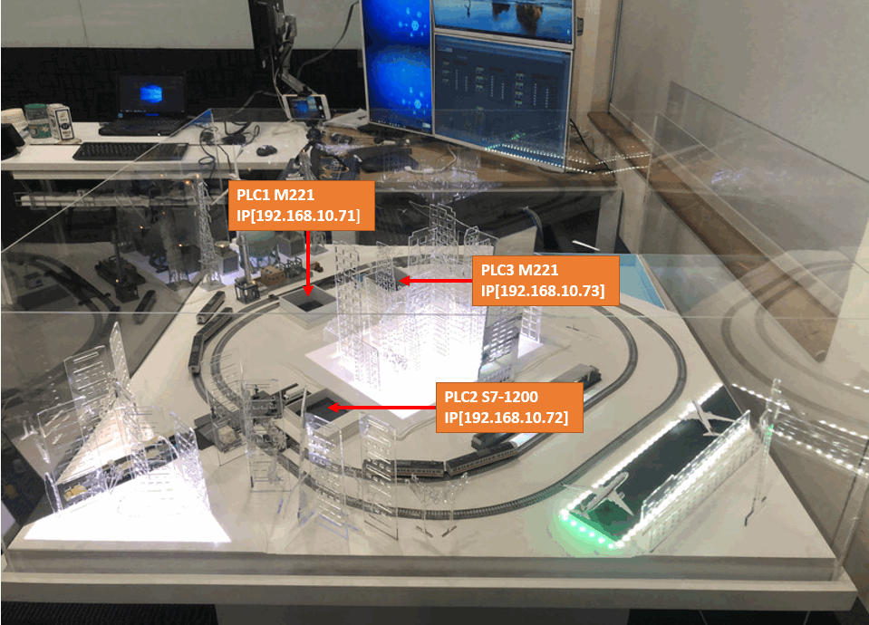

# Railway_Control/OT-Cyber Attack

> All rights reserved by NUS-Singtel Cyber Security R&D Lab (Jun 2016 to Jun 2021)

**Program Design Purpose**:  We want to build a city simulator OT(Operational Technology) system with two railways and create two kinds of HMI software (Engineer monitoring HMI and the Lecturer training HMI) to control the system. We also want to use this system to demo different kinds of PLC OT-Cyber attack by implementing the related attack simulation function. 

[TOC]

### Introduction

This project will implement an HMI for the OT-3D-City simulator platform and power management simulator platform (generator and substation). Then we will demonstrate different kinds of cyber-attack situation on both simulator platform. The project contains four main sections: 

1. **OT-City Simulator HMI Program**: In this section we will create a SCADA HMI system with Schneider Wonderware(R) program running on the SCADA PC for the user to control the OT-3D-city simulator modules for the training and research purpose. We will also create a plug-and-play engineer monitoring HMI for the system analysis and exception checking. 
2. **OT Platform Cyber Attack Simulation**: In this section we will demonstrate 3 different kinds of cyber-attack situation on the OT-platform and power management module: False data injection attack, Blackout attack and the Stealthy situation attack. The attack demonstration will be activated by the attack control website and launched from an attack control device (Raspberry PI) which connected to the system network. `Reference link:` https://github.com/LiuYuancheng/RailWay_PLC_Control/tree/master/attack/remoteAtk
3. **OT-Cyber-Attack Control Website**: In this section we will create a website server running on the orchestrator PC to provide a web interface to let the user control different cyber-attack demos on OT-platform and show current system feedback/attack detail information during the presentation. The user will active/stop the attack demo by login the attack control webpage. `Reference link:`https://github.com/LiuYuancheng/OT_Platform_Attack_Web
4. **OT-Cyber-Attack Power Generator and Substation Manager**: We will provide a user interface running on the SCADA PC to remote control the OT-Power Generator Module. We will provide a module controller made by one Raspberry PI and an Arduino to receive the control request from the remove controller UI and change the state of the hardware components of Power Generator Module such as Pump, moto, and LED display panel. The control program will also do the automatically adjustment of the generator's motor and pump speed based on the loads in the system. `Reference link:` https://github.com/LiuYuancheng/Power_Generator_Manager

#### System Overview Diagram

The relation ship of the four main section is show as the below overview diagram: 



`version 2.1`


------

### System/Program Design

#### Design of Engineer Monitoring HMI

Engineer Monitoring HMI running on engineer's laptop, the engineer can use it to monitor/overwrite all the parameters when plug  it into the system. The use can also run the HMI independently to simulate different control situation and simulate three kinds of general program attack without connect it to the system. The main function contents: 

- Control/simulate different components in the city-railway system and 2 trains.
- Show the real time PLC Input/Output coils signal or simulate the signal change.
- Show the PLC Memory /register status or overwrite these PLC data.
- Change the system setting and start different cyber attack simulation. (man in mid, Trojan and  Ransomware attack)

##### Engineer Monitoring HMI UI View 




#### Design of Lecturer Training HMI

Lecturer Training HMI will provide a supervisory control and data acquisition (SCADA) human-machine interface (HMI) program to control the components in CSI OT-3D Cyber-attack demonstration platform. We will create two kinds of SCADA HMI system by using Schneider-Wonderware(R) software and python to let the user control the PLC railway modules or simulate different kinds of railway operation for training or research purpose. 

##### Lecturer Training HMI UI View

The Schneider-Wonderware HMI program are mainly used for the demo purpose, it contents three main pages:

- Training SCADA HMI page is mainly used for training and demonstration task.

  

- PLC Status View HMI page is used the for showing the working flow logic of the PLC modules in the system. 

  

- Railway Command and Control HMI page is used to simulate and demonstrate the railway command control center's operational sequence. 

  


#### OT Cyber Attack Simulation Design 

The system will provide three new cyberattack demo on the CSI OT Demo platform, namely the “False Data Injection Attack”, “Blackout Attack” and “Stealthy situation attack”. The attack detail is shown in :  https://github.com/LiuYuancheng/RailWay_PLC_Control/tree/master/attack/remoteAtk

##### Attack Work Flow Diagram




------

### Program Setup

###### Development Environment  

Python 2.7 & python 3.7,  HTML5, Schneider Wonderware IDE

###### Additional Lib/Software Need 

1. wxPython 4.0.6 (build UI this lib need to be installed) 

   ```
   pip install -U wxPython 
   ```

2. snap7 + python-snap7 (need to install for S71200 PLC control) 

   ```
   Install instruction: 
   http://simplyautomationized.blogspot.com/2014/12/raspberry-pi-getting-data-from-s7-1200.html
   ```

##### Hardware Needed 

| **Idx** | **Name**                              | **Components**                                               | **Function**                                                 |
| ------- | ------------------------------------- | ------------------------------------------------------------ | ------------------------------------------------------------ |
| **0**   | OT 3D Platform                        | OT 3D Platform  M221 PLC X 2   S7-1200 PLC X 1  Control Arduino | Main OT-City simulator platform.                             |
| **1**   | SCADA PC                              | Dell  server #2  Monitor 3  Touch  screen                    | Show the  HMI for user to control and show the presentation. |
| **2**   | Technical PC                          | ThinkPad laptop  Monitor 2                                   | Edit the PLC ladder diagram and show  the Back out attack presentation. |
| **3**   | Orchestrator  PC                      | Dell  server #3  Monitor  1                                  | Host the  attack control website and for user to launch/stop the attack. |
| **4**   | Attack Raspberry PI                   | Control Raspberry PI                                         | Implement the attack at the background.                      |
| **5**   | Power Generator  Control Raspberry PI | Power  generator platform  Control  Raspberry PI  Control  Arduino | Control  the power generator module.                         |
| **6**   | Network switch                        | Network switch X2                                            | Config the network.                                          |



The system use Schneider M221 and Siemens s7-1200 to control the hardware. 

PLC memory and coils setting: 

| PLC 0 [schneider M221]      | PLC 1 [seimens S7-1200]         | PLC 2 [schneider M221]   |
| --------------------------- | ------------------------------- | ------------------------ |
| 192.168.10.72               | 192.168.10.73                   | 192.168.10.71            |
| M0  => Q0.0 Airport LED     | Qx0.0 => Q0.0 station + sensor  | M0  => Q0.0 fork turnout |
| M10 => Q0.1 Power Plant     | Qx0.1=> Q0.1 level crossing pwr | M10 => Q0.1 track A pwr  |
| M60 => Q0.2 Industrial LED  | Qx0.2=> Q0.2 Resident LED       | M20 => Q0.2 track B pwr  |
| attack/Industrial_Zone.smbp | attack/ City_Zone.smbp          | M60 = > Q0.3 city LED    |




###### Program File List :

| Program File                | Execution Env            | Description                                                  |
| --------------------------- | ------------------------ | ------------------------------------------------------------ |
| src/M2PLC221.py             | python 2.7/3             | This module is used to connect the Schneider M2xx PLC.       |
| src/railwayAgentPLC.py      | python 3                 | This module is the agent module to init different items in the railway system or create the interface to connect to the hardware. |
| src/railwayGlobal.py        | python 3                 | This module is used as the local config file to set constants, global parameters which will be used in the other modules. |
| src/railwayHub.py           | python 3                 | This function is used to create a rail control hub to show the different situation of the cyber-security attack's influence for the railway HMI and PLC system. |
| src/railwayMgr.py           | python 3                 | This function is the railway function manager to connect the agent element with their control panel. |
| src/railWayPanel.py         | python 3                 | This module is used to provide different function panels for the rail way hub function. |
| src/railWayPanelMap.py      | python 3                 | This module is used to show the top view of the main city map in the railway system. |
| src/ S7PLC1200.py           | python 3                 | This module is used to connect the siemens s7-1200 PLC       |
| attack/ City_Zone.smbp      | Schneider Wonderware IDE | City Zone PLC ladder diagram.                                |
| attack/Industrial_Zone.smbp | Schneider Wonderware IDE | Industrial Zome PLC ladder diagram.                          |

`version V_2.1` 

------

### Program Usage/Execution

###### Program execution cmd: 

```
python railwayHub.py
```


------

### Problem and Solution

N.A


------

### Reference

N.A


------

> Last edit by LiuYuancheng(liu_yuan_cheng@hotmail.com) at 15/02/2022